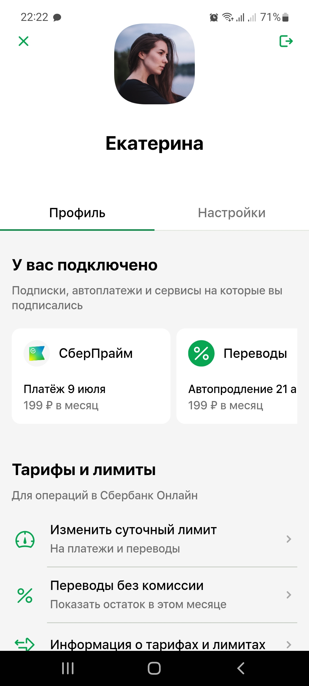
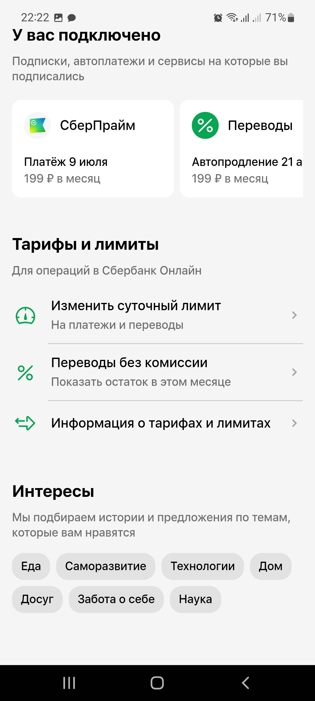
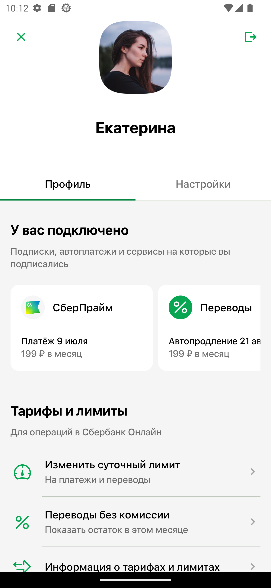
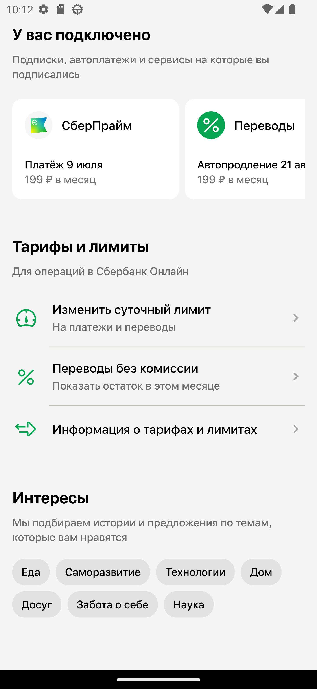

# Лабораторная работа Flutter
В данной лабораторной работе необходимо было реализовать макет экрана с использованием Flutter.

* Версия Flutter: 3.16.0
* Dart: 3.2.0
* DevTools: 2.28.2

Данный репозиторий содержит исходники приложения. В конце README представлены скрины.

[Скачать приложение на Android](https://disk.yandex.ru/d/SwM09KjHH_rpVw)

Чтобы открыть проект, необходимо скачать репозиторий:
```git
git clone https://github.com/kiryushaz/effective_flutter.git
```
И убедиться, что приложение работает.

Проверено на телефоне под ОС Android `Samsung Galaxy M31S (Android 12)`:

<p align="center">


<p>

Проверено на эмуляторе Android `Pixel 7 Pro API 33`:

<p align="center">


<p>

Проверено в браузере `Chrome` при мелком разрешении экрана:

<p align="center">


<p>